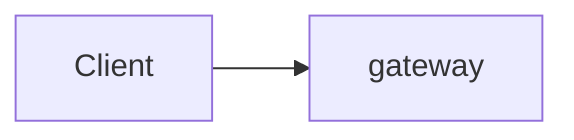
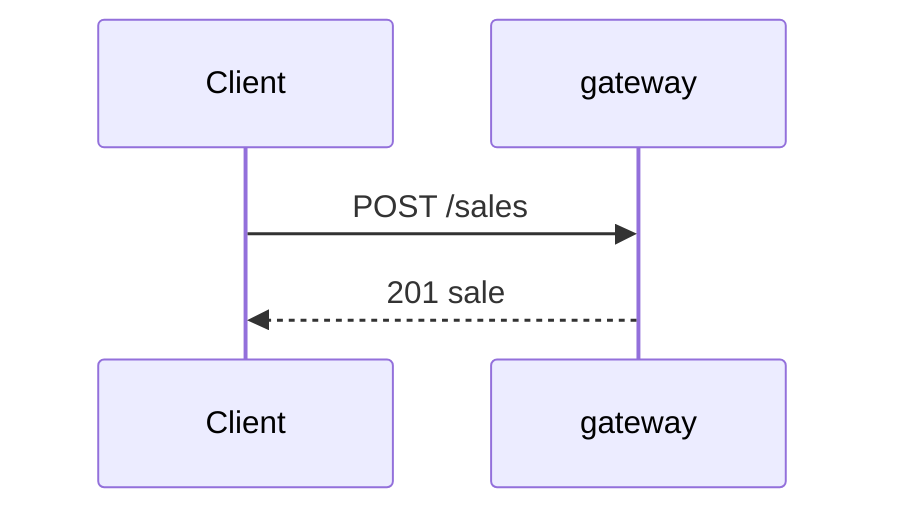

# Design

> This is the specification you give the coding agent, one section per
> variant. Be precise: what you leave open, the agent decides for you.
> The rules of each variant are in `variant-a/README.md` and
> `variant-b/README.md`; the external behaviour is in `contract.md`.
> Delete the quoted guidance when you are done.

## Decisions common to both variants

> For example: technology per service, how services talk to each other
> (HTTP, messages), how a request that spans services stays all-or-nothing,
> how the call log is written, how the seed data is loaded.

| Decision | Choice | Reason |
|----------|--------|--------|
| | | |

### Policy for the change requests

> Do you prepare the design for CR1 and CR2 before `v1`? What exactly, and
> why? The same policy applies to both variants.

---

## Variant A: data-aligned

### Services

| Service | Responsibility | Owns (legacy tables) | Store |
|---------|----------------|----------------------|-------|
| gateway | routing, composition | none | none |
| | | | |

### Components

### Use case flows

> For each use case: which services take part, in which order, synchronous
> or asynchronous. At least checkout and the Z-report as sequence diagrams.

### All-or-nothing

> A failed request changes nothing (contract). How do you guarantee this when
> a sale touches stock, gift cards and points in different services?

### Failure behaviour

| What fails | What happens | Why this is acceptable or not |
|------------|--------------|-------------------------------|
| | | |

---

## Variant B: capability-aligned

### Services

| Service | Capability | Owns (its own model) | Copies of data from others (source, how kept current) | Store |
|---------|------------|----------------------|--------------------------------------------------------|-------|
| gateway | routing, composition | none | none | none |
| | | | | |

### Components

### Use case flows

### Language

| Legacy name | Name in this variant | Service |
|-------------|----------------------|---------|
| ticket_system | | |
| | | |

### All-or-nothing

### Failure behaviour

| What fails | What happens | Why this is acceptable or not |
|------------|--------------|-------------------------------|
| | | |
